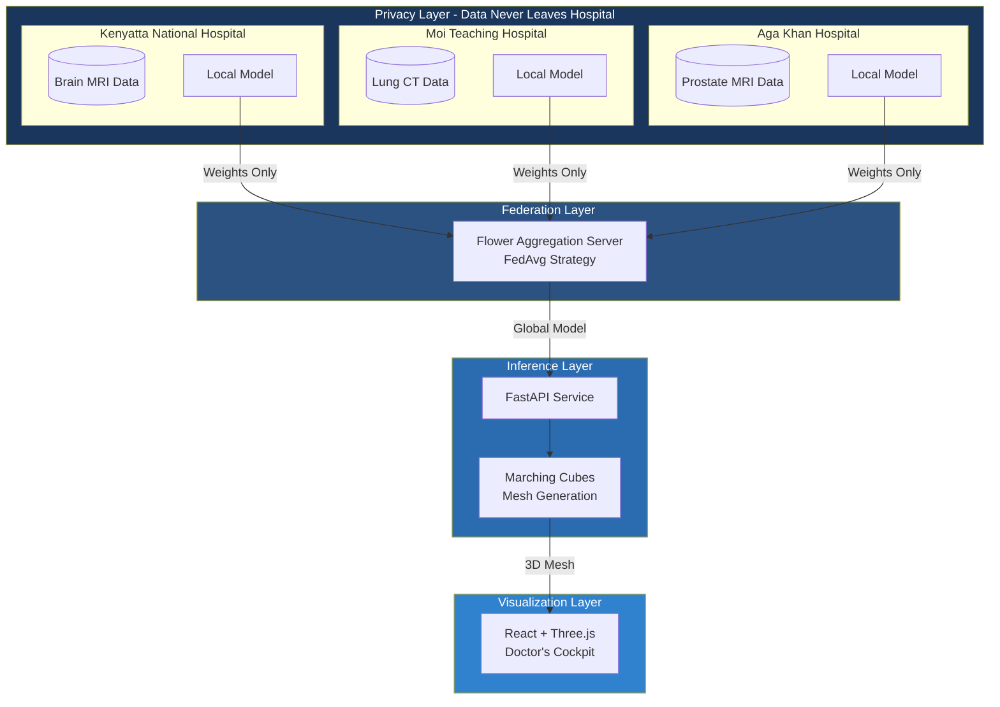
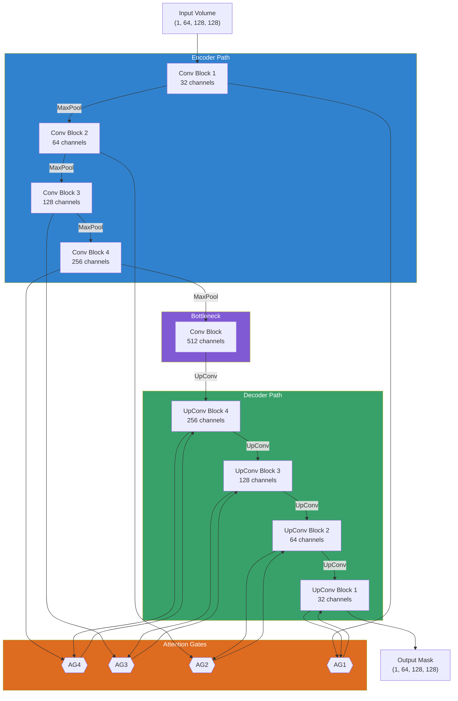
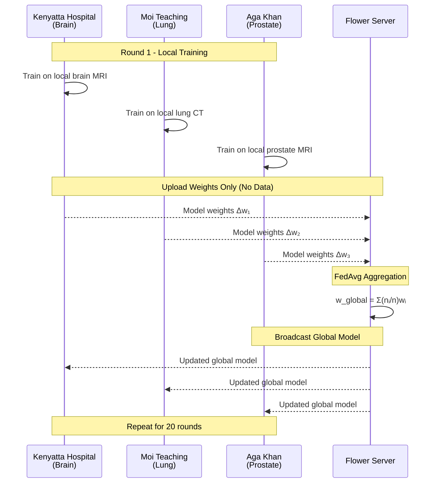
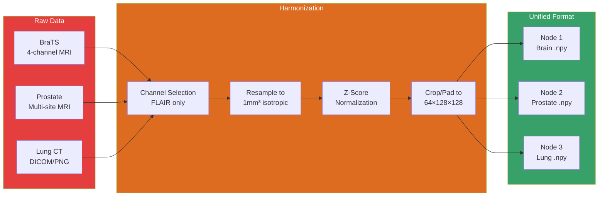
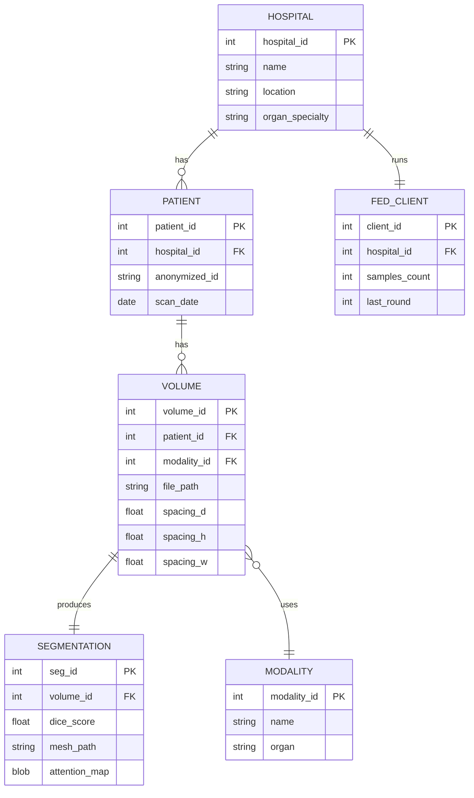
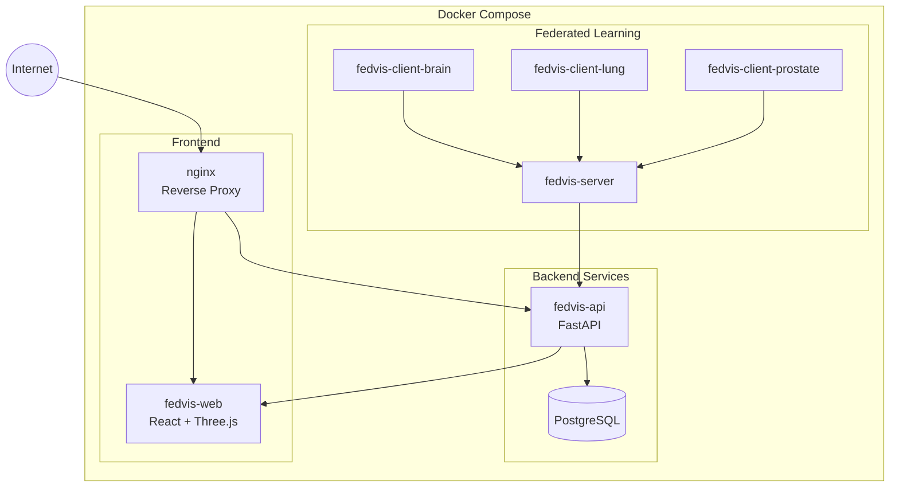
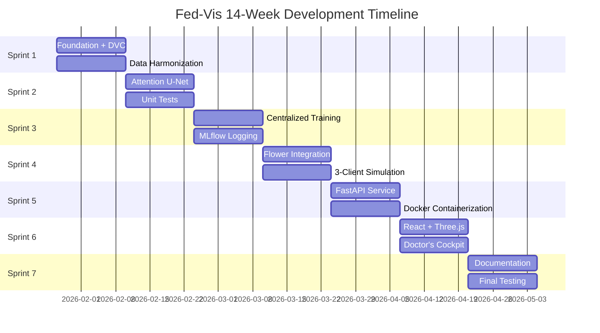

# Fed-Vis System Design Diagrams

All diagrams use Mermaid syntax for rendering. Copy into any Mermaid-compatible viewer or include directly in markdown documents.

---

## 1. System Architecture Overview

---

## 2. Attention U-Net Architecture

---

## 3. Federated Learning Flow

---

## 4. Data Harmonization Pipeline

---

## 5. ERD Diagram

---

## 6. Deployment Architecture (Docker)

---

## 7. Gantt Chart Timeline

